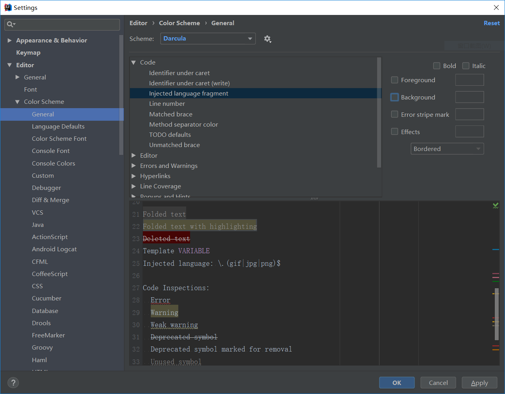

## 快捷键

Ctrl + /	注释

Ctrl + D	复制行

删除一整行：在不选中的情况下  **Ctrl + X**  

ctrl + alt+ s：打开Settings

Alt + Insert


parameter	参数

attribute	属性

表现层状态转换Representational State Transferhttps://zh.wikipedia.org/wiki/%E8%A1%A8%E7%8E%B0%E5%B1%82%E7%8A%B6%E6%80%81%E8%BD%AC%E6%8D%A2

RESTful：/user/delete/288

传统：/user/delete?id=288

@RestController

= @ResponseBody + @Controller


按住Alt往下拉鼠标选中多行，输入即可同时写多行代码

去除mybatis的xml中黄色背景提示：

1. Editor -> Inspections，去掉SQL中SQL dialect detection和No data sources configured
2. Editor -> Color Schema -> Code -> Injected language fragment，去掉Background




markdown 代码整体缩进快捷键：Ctrl + [ 或 ]

CURD：（Create）、更新（Update）、读取（Retrieve）和删除（Delete）操作。


Mapper：映射器

Wrapper：包装器


Entity：实体 / model / vo / pojo / beans

POJO ：plain ordinary java object 无规则简单java对象


alias：别名

inspection：检查


实体包装器 EntityWrapper用于处理 sql 拼接，排序，实体参数查询等！

## 条件参数说明

| 查询方式     | 说明                              |
| ------------ | --------------------------------- |
| setSqlSelect | 设置 SELECT 查询字段              |
| where        | WHERE 语句，拼接 + `WHERE 条件`   |
| and          | AND 语句，拼接 + `AND 字段=值`    |
| andNew       | AND 语句，拼接 + `AND (字段=值)`  |
| or           | OR 语句，拼接 + `OR 字段=值`      |
| orNew        | OR 语句，拼接 + `OR (字段=值)`    |
| eq           | 等于=                             |
| allEq        | 基于 map 内容等于=                |
| ne           | 不等于<>                          |
| gt           | 大于>                             |
| ge           | 大于等于>=                        |
| lt           | 小于<                             |
| le           | 小于等于<=                        |
| like         | 模糊查询 LIKE                     |
| notLike      | 模糊查询 NOT LIKE                 |
| in           | IN 查询                           |
| notIn        | NOT IN 查询                       |
| isNull       | NULL 值查询                       |
| isNotNull    | IS NOT NULL                       |
| groupBy      | 分组 GROUP BY                     |
| having       | HAVING 关键词                     |
| orderBy      | 排序 ORDER BY                     |
| orderAsc     | ASC 排序 ORDER BY                 |
| orderDesc    | DESC 排序 ORDER BY                |
| exists       | EXISTS 条件语句                   |
| notExists    | NOT EXISTS 条件语句               |
| between      | BETWEEN 条件语句                  |
| notBetween   | NOT BETWEEN 条件语句              |
| addFilter    | 自由拼接 SQL                      |
| last         | 拼接在最后，例如：last("LIMIT 1") |

注意！ xxNew 都是另起 `( ... )` 括号包裹。

------

```java
SysUser_Info sysUser_info = sysUserInfoService.selectById(id);

EntityWrapper<Question> ew = new EntityWrapper<>();

ew.where("pat_name={0}",Name).and("birthday={0}",df.parse(Birthday)).and("pat_sex={0}",Sex);

Question question = questionService.selectOne(ew);
```


```
数据服务层 Service

数据库控制层 
	Mapper/Dao 与数据库接口 
	xml配置 	  实现


Dao 数据访问对象
```


## Navicat常用快捷键 :

ctrl+q 打开查询窗口 
ctrl+/ 注释 
ctrl +shift+/ 解除注释 
ctrl+r 运行选中的SQL语句 
ctrl+l 删除选中行内容 
ctrl+d 复制当前行内容并粘贴到下一行 
ctrl+w 关闭当前查询窗口  


```sql
SELECT * FROM addresses WHERE addr_id in(1,2,3,4,5)
```

1	4891 Pacific Hwy	San Diego	CA	92110	San Diego
2	2400 N Jeffrson St	Perry	FL	32347	Taylor
3	710 N Cable Rd	Lima	OH	45825	Allen
4	5108 W Core Bivd	Lawton	OK	32365	Comanche
5	某某某街道	aa	湖北	1263	中国


**JavaBeans**是[Java](https://zh.wikipedia.org/wiki/Java)中一种特殊的[类](https://zh.wikipedia.org/wiki/%E7%B1%BB_(%E8%AE%A1%E7%AE%97%E6%9C%BA%E7%A7%91%E5%AD%A6))，可以将多个[对象](https://zh.wikipedia.org/wiki/%E5%AF%B9%E8%B1%A1_(%E8%AE%A1%E7%AE%97%E6%9C%BA%E7%A7%91%E5%AD%A6))封装到一个对象（bean）中。特点是可[序列化](https://zh.wikipedia.org/wiki/%E5%BA%8F%E5%88%97%E5%8C%96)，提供[无参构造器](https://zh.wikipedia.org/w/index.php?title=%E6%97%A0%E5%8F%82%E6%9E%84%E9%80%A0%E5%99%A8&action=edit&redlink=1)，提供[getter方法和setter方法](https://zh.wikipedia.org/w/index.php?title=%E8%B5%8B%E5%80%BC%E6%96%B9%E6%B3%95&action=edit&redlink=1)访问对象的属性。名称中的“Bean”是用于Java的可重用软件组件的惯用叫法。

Bean的中文含义是“豆子”，顾名思义JavaBean是一段Java小程序。


定义JavaBean中成员变量时使用的类型：

因为每个基本类型都有一个默认值：

int：0

boolean：false


## JSP

```jsp
<c:forEach items="${fileNames}" var="obj">
    <h2>${obj}</h2>
</c:forEach>
```


## 关于重定向RedirectAttributes的用法

**RedirectAttributes** 是Spring mvc 3.1版本之后出来的一个功能，专门用于重定向之后还能带参数跳转的的工具类
他有两种带参的方式：

**第一种：**

redirectAttributes.addAttributie("prama",value); 这种方法相当于在重定向链接地址追加传递的参数，例如:

```java
redirectAttributes.addAttributie("prama1",value1);

redirectAttributes.addAttributie("prama2",value2);

return:"redirect：/path/list" 
```

以上重定向的方法等同于 return:"redirect：/path/list？prama1=value1**&**prama2=value2 " ，注意这种方法直接将传递的参数暴露在链接地址上，非常的不安全，慎用。

**第二种：**

redirectAttributes.addFlashAttributie("prama",value); 这种方法是隐藏了参数，链接地址上不直接暴露，但是能且只能在重定向的 “页面” 获取prama参数值。其原理就是放到session中，session在跳到页面后马上移除对象。如果是重定向一个controller中是获取不到该prama属性值的。除非在controller中用(@RequestPrama(value = "prama")String prama)注解，采用传参的方式。页面获值例如：

```java
redirectAttributes.addFlashAttributie("prama1",value1);

redirectAttributes.addFlashAttributie("prama2",value2);

return:"redirect：/path/list.jsp" 
```

在以上参数均可在list.jsp页面使用EL表达式获取到参数值${prama*}

controller获得redirectAttributes重定向的值例如：

```java
redirectAttributes.addFlashAttributie("prama1",value1);

redirectAttributes.addFlashAttributie("prama2",value2);

return:"redirect：/path/list/"

@RequestMapping("list")
public List<Student> list(@RequestPrama(value = "prama1")String  prama1,
   @RequestPrama(value = "prama2")String  prama2,...
){
    //TODO
    //your code

}
```

通过在controller中的list方法体中可以获取到参数值。


httpServletRequest

getHeader	getCookies


```java
Cookie cookie = null;
cookie = new Cookie("Login",login_username+"-"+ Md5util.md5(login_username));
httpServletResponse.addCookie(cookie);

//Set-Cookie: Login="admin-ISMvKXpXpadDiUoOSoAfww=="

httpSession.setAttribute("uid",sysUser_info.getLogin_username());
```


```js
var car = {"type":"Fiat", "model":"500", "color":"white"};也可以
```


## 问题

```java
return "redirect:/tip3";
```

BaseController


```jsp
${empty message ? '请输入账户名和密码' : message}
```


## JAVA

- **StringUtils.isEmpty(String str)** 判断某字符串是否为空，为空的标准是 str==null 或 str.length()==0

```java
System.out.println(StringUtils.isEmpty(null));        //true
System.out.println(StringUtils.isEmpty(""));          //true
System.out.println(StringUtils.isEmpty(" "));         //false
System.out.println(StringUtils.isEmpty("dd"));        //false
```

**StringUtils.isNotEmpty(String str)** 等价于 !isEmpty(String str)


- **StringUtils.isBlank(String str)** 判断某字符串是否为空或长度为0或由空白符(whitespace) 构成

```java
System.out.println(StringUtils.isBlank(null));        //true
System.out.println(StringUtils.isBlank(""));          //true
System.out.println(StringUtils.isBlank(" "));         //true
System.out.println(StringUtils.isBlank("dd"));        //false    
```

**StringUtils.isNotBlank(String str)**等价于 !isBlank(String str)


```java
StringUtils.isNotBlank((String) httpSession.getAttribute("uid"))
```

